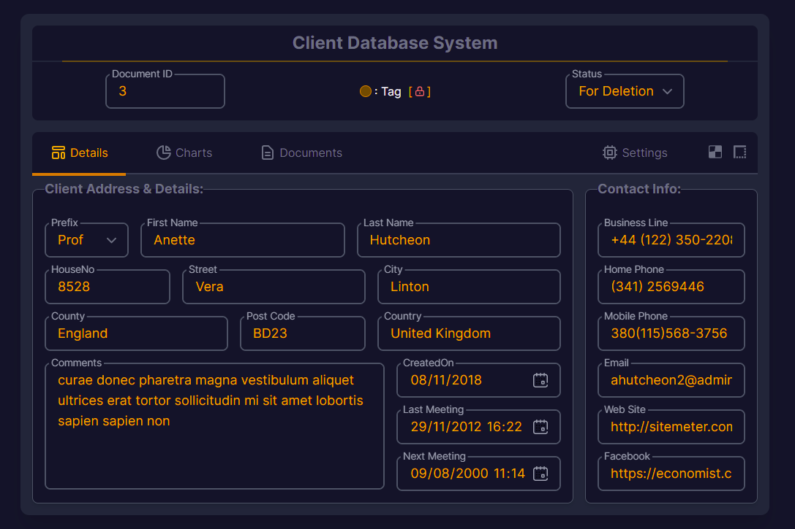
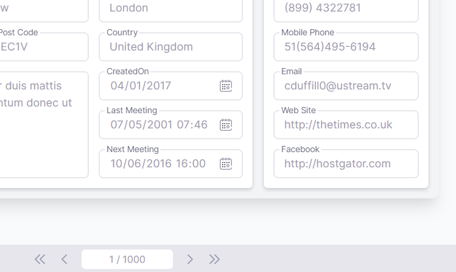

# DataSafe ver. 6.0 Tailwind

Light Dark Concept Design

Made with Tailwind CSS

Outline Floating Labels with working Placeholder text

[See it in action here...](https://avertry.github.io/DS6)

Designed for Chrome, Brave, Edge - Chromium Engine 8+
